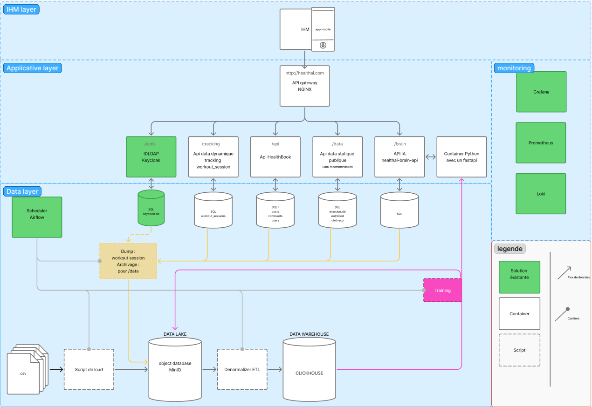
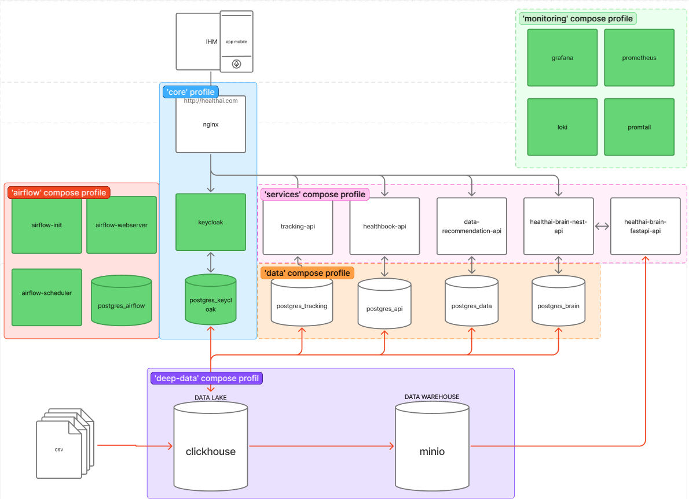

# How It Works

## Schema

Here is the general schema we use to visualize the infrastructure

## High-Level Architecture

The stack is organized into compose profile groups:

- core
  - nginx
  - keycloak
  - postgres_keycloak
- services
  - healthbook-api
  - tracking-api
  - data-recommendation-api
  - healthai-brain-nest-api (public, routed via /brain/)
  - healthai-brain-fastapi-api (internal AI inference, not routed via gateway)
- data
  - postgres_api
  - postgres_tracking
  - postgres_data
  - postgres_brain
- airflow
  - postgres_airflow
  - airflow-init
  - airflow-webserver
  - airflow-scheduler
- monitoring
  - prometheus
  - loki
  - grafana
  - promtail
- deep-data
  - clickhouse
  - minio

All services share one Docker network named app in each compose file.

## Reverse Proxy Design

NGINX is the single entrypoint for HTTP traffic.

Routing rules:

- /auth/ -> keycloak:8080/
- /api/ -> healthbook-api:3000
- /tracking/ -> tracking-api:3001
- /data/ -> data-recommendation-api:3002
- /brain/ -> healthai-brain-nest-api:3003

Path prefixes are stripped before forwarding to backend services.
Example: /api/v1/patients is forwarded as /v1/patients.

The Brain FastAPI (healthai-brain-fastapi-api:8000) is not routed through the gateway.
It is only reachable from other containers on the app network, specifically from healthai-brain-nest-api.

Gateway health endpoint:

- /health returns 200 from NGINX directly.

## Auth Responsibility Boundary

- NGINX does not perform JWT validation.
- Each Nest service validates Bearer tokens itself.

Service auth variables:

- KEYCLOAK_ISSUER should match JWT iss claim.
- KEYCLOAK_AUDIENCE should match JWT aud claim for each service.

In this repository, issuer is typically:

- http://keycloak:8080/realms/mspr

## Data Layer Model

Each API service has an isolated Postgres database:

- healthbook-api -> postgres_api
- tracking-api -> postgres_tracking
- data-recommendation-api -> postgres_data
- healthai-brain-nest-api -> postgres_brain

Additional databases:

- postgres_keycloak for Keycloak metadata
- postgres_airflow for Airflow metadata

## Brain API Model

The Brain API is split into two containers:

- healthai-brain-nest-api: public NestJS service. Handles auth (Keycloak JWT), business logic, and
  calls the FastAPI for AI inference via AI_SERVICE_URL.
- healthai-brain-fastapi-api: internal Python/FastAPI service. Runs HuggingFace image classification
  models. Has no Keycloak auth and is not reachable from outside the Docker network.

Two named volumes persist state across restarts:

- brain_venv: Python virtual environment. Prevents reinstalling PyTorch on every container start.
- brain_hf_cache: HuggingFace model weights. Prevents re-downloading models on every start.

## Deep Data / Warehouse Model

The deep-data profile is an optional analytics warehouse, separate from the per-service
Postgres databases used for transactional data:

- clickhouse: columnar warehouse. Seeded on first start from
  deep-data/clickhouse/init/\*.sql with databases for exercise_db, daily_food,
  diet_recommendation, and workout_session, plus raw landing tables.
- minio: S3-compatible object storage used as a data lake for raw datasets
  before they are loaded into ClickHouse.

Airflow DAGs (dump_api_to_lake, load_warehouse, load_lake_to_recommendation) move data
from the service APIs into MinIO and then into ClickHouse, and read ClickHouse data back
out for model training.

## Monitoring Model

(see the dedicated pdf about the monitoring, ps: c'est un autre livrable )

Prometheus:

- Scrapes itself
- Contains placeholders for service metrics on /metrics

Loki:

- Runs in single binary mode
- Stores data in local filesystem within container volume paths

Promtail:

- Discovers Docker containers for this stack via Docker service discovery
- Tails container JSON logs and pushes them to Loki
- Labels logs with compose project and compose service for filtering in Grafana
- Excludes monitoring self-logs (loki, promtail, grafana, prometheus) to avoid recursive log amplification

Grafana:

- Starts with pre-provisioned datasources
  - Prometheus at http://prometheus:9090
  - Loki at http://loki:3100
- Loads dashboards from monitoring/grafana/dashboards

## Airflow Model

Airflow profile includes:

- DB initialization and migration via airflow-init
- Webserver for UI access
- Scheduler for DAG execution
- Local mounts for dags, plugins, and requirements

DAGs represent scheduled jobs (archival, backup, restore, ETL, etc.).

## Why Service Ports Are Not Published

Service containers use expose: 3000 and are not bound to host ports.
This enforces gateway-first access patterns and keeps host port usage clean.

## Keycloak Access Paths

Internal (from containers):

- http://keycloak:8080/realms/mspr

External (through gateway):

- http://localhost:8080/auth/

Keep issuer usage consistent between token issuing and token validation paths.
